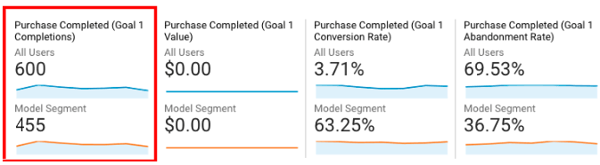

```{r setup, include=FALSE}
library(knitr)
opts_chunk$set(echo = TRUE, warning = FALSE, message = FALSE)
```

# Setup and authentication

```{r auth, message=FALSE}
## assumes you have client JSON saved to environment argument GAR_CLIENT_JSON
## in .Renviron file: `GAR_CLIENT_JSON="~/path/to/clientjson.json"`
## instructions here: http://code.markedmondson.me/googleAuthR/articles/google-authentication-types.html#setting-the-client-via-google-cloud-client-json
app_project <- googleAuthR::gar_set_client(
  scopes = c("https://www.googleapis.com/auth/cloud-platform"))

library(bigQueryR)

googleAuthR::gar_auth("bq.oauth")

# set BigQuery defaults
bqr_global_project("gcp-project-id")
bqr_global_dataset("google_analytics_sample")
```

Check auth works and in right project:

```{r, message=FALSE, warning=FALSE}
library(dplyr)
# UNCOMMENT LINE BELOW 
# kable(bqr_list_projects()) 
```

# Problem definition

## Target Variable

The target or label for this model will be `transacted` and a binary (0 or 1) variable. 

This is defined as `ga:transaction` and `goal1` in the Google Merchandise store GA dataset.

# Create datasets 

## Create BigQuery tables for target variable

First, we create a table of all sessions with transactions and save to `gcp-project-id.ga_sample_model.transaction_sessions` (23,211 rows):

```sql
#legacysql
SELECT
  (visitStartTime + hits.time) AS hitTimestamp,
  fullVisitorId,
  visitId,
  clientId,
  TRUE AS transacted
FROM (TABLE_DATE_RANGE([bigquery-public-data:google_analytics_sample.ga_sessions_],
      TIMESTAMP('2016-08-01'),
      TIMESTAMP('2017-08-01')))
WHERE
  hits.item.transactionId IS NOT NULL
GROUP BY
  1,2,3,4
```

Next, we create a table of sessions *of the same size* who did not convert/in the table above and save it to `gcp-project-id.ga_sample_model.antibalance`: 

```sql
#legacysql
SELECT
  *
FROM (
  SELECT
    RAND() AS rand,
    fullVisitorId,
    visitId,
    FALSE as transacted
FROM (TABLE_DATE_RANGE([bigquery-public-data:google_analytics_sample.ga_sessions_],
      TIMESTAMP('2016-08-01'),
      TIMESTAMP('2017-08-01')))
  GROUP BY 1,2,3)
WHERE
  visitId NOT IN (
  SELECT
    visitId
  FROM
    [gcp-project-id:ga_sample_model.transaction_sessions])
ORDER BY
  rand
LIMIT
  23211 # sample size
```

We then combine these tables to have a data set of sessions with a 50/50 split of transactions vs not transactions. This is saved to `gcp-project-id.ga_sample_model.transactions_balanced`: 

```sql
#legacysql
SELECT
  *
FROM (
  SELECT
    fullVisitorId,
    visitId,
    transacted
  FROM
    [gcp-project-id:ga_sample_model.transaction_sessions]),
  (
  SELECT
    fullVisitorId,
    visitId,
    transacted
  FROM
    [gcp-project-id:ga_sample_model.transactions_antibalance] )
```

This table will then be joined to the explantory dataset, with `transacted` used as the binary (0 or 1) dependent variable. 

## Adding features

Create table of features in `gcp-project-id:ga_sample_model.explantory_vars`:

```sql
#legacysql
SELECT
    fullVisitorId,
    visitId,
    clientId,
    visitNumber,
    (visitStartTime + hits.time) AS hitTimestamp,
    trafficSource.source AS source,
    trafficSource.medium AS medium,
    trafficSource.keyword AS keyword,
    device.deviceCategory AS deviceCategory,
    geoNetwork.region AS region,
    hits.page.pagePath as pagePath,
    hits.eventInfo.eventCategory AS eventCategory,
    hits.eventInfo.eventAction AS eventAction,
    hits.eventInfo.eventLabel AS eventLabel    
FROM (TABLE_DATE_RANGE([bigquery-public-data:google_analytics_sample.ga_sessions_],
      TIMESTAMP('2016-08-01'),
      TIMESTAMP('2017-08-01')))
```

Finally, join `gcp-project-id.ga_sample_model.transactions_balanced` and  `gcp-project-id:ga_sample_model.explantory_vars` and to create `gcp-project-id:ga_sample_model.transaction_modeldata`: 

```sql
#legacysql
SELECT
    a.fullVisitorId as fullVisitorId,
    a.visitId as visitId,
    a.transacted as transacted,
    b.clientId as clientId,
    b.visitNumber as visitNumber,
    b.hitTimestamp AS hitTimestamp,
    b.source AS source,
    b.medium AS medium,
    b.keyword AS keyword,
    b.deviceCategory AS deviceCategory,
    b.region AS region,
    b.pagePath as pagePath,
    b.eventCategory AS eventCategory,
    b.eventAction AS eventAction,
    b.eventLabel AS eventLabel
FROM
  [gcp-project-id:ga_sample_model.transactions_balanced] AS a
LEFT JOIN
  [gcp-project-id:ga_sample_model.explantory_vars] AS b
ON
  a.visitId = b.visitId
  AND a.fullVisitorId = b.fullVisitorId
```

This is the dataset we will export into R for modeling.

# Model Data Processing

Extract to Google Cloud Storage and pull data into R via `googleCloudStorageR`:

```r
library(bigQueryR)
library(googleCloudStorageR)
 
job <- bqr_extract_data("gcp-project-id",
                        datasetId = "ga_sample_model",
                        tableId = "transactions_modeldata",
                        cloudStorageBucket = "bucket-name/ga_sample_model",
                        filename = "transactions_model.csv")
bqr_wait_for_job(job)

gcs_get_object("ga_sample_model/transactions_model.csv",
               bucket = "bucket-name",
               saveToDisk = "data/transactions_model.csv")

# resave as rds for quicker loading/saving
trans_data_all <- read.csv("data/transactions_model.csv", stringsAsFactors = FALSE)
saveRDS(trans_data_all, "data/transactions_model.rds")
```

The downloaded data:

```{r}
trans_data_all <- readRDS("data/transactions_model.rds")
kable(head(trans_data_all))
```

## Data transformation

Creating features of one column (one hot encoding or dummy variables) by level of event, page, medium and device columns. The datasets are merged into a encoded matrix suitable for modeling.

### Remove target variables 

Remove the pages for the target variable (e.g. - order confirmation page, final checkout page) so our model will find other unknown factors:

```{r}
library(dplyr)
trans_data <- trans_data_all %>%
  # remove target variable pages
  filter(!(pagePath == "/payment.html" |
           pagePath == "/ordercompleted.html")) 

target_var_rows_rm <- nrow(trans_data_all) - nrow(trans_data)
target_var_rows_rm
```

### Create features from one column variables

```{r message=FALSE, warning=FALSE}
library(dplyr)
library(tidyr)
library(broom)

trans_trans <- trans_data %>% 
  mutate(event_all = paste(eventCategory, eventAction, eventLabel, sep="-")) %>% 
  group_by(visitId) %>% 
  arrange(hitTimestamp) %>% 
  mutate(hitNumber = n()) %>% 
  ungroup()

# pages are all rows where event_all is --
# code page base folder to one per column 
trans_pages_coded <- trans_trans %>% 
  filter(event_all == "--") %>% 
  select(visitId, pagePath) %>% 
  mutate(basepath = paste0("page-",gsub("^/(.+?)/(.+)", "\\1", pagePath))) %>% 
  group_by(visitId, basepath) %>% 
  summarise(count = n()) %>% 
  spread(basepath, count, fill = 0)

# code eventCategory and eventAction to one per column
trans_events_coded <- trans_trans %>% 
  filter(event_all != "--") %>% 
    mutate(eventCategory = paste0("eventCat-",eventCategory)) %>% 
  group_by(visitId, eventCategory) %>% 
  summarise(count = n()) %>% 
  spread(eventCategory, count, fill = 0) 

# code medium to oen per column
trans_medium_coded <- trans_trans %>% 
  filter(event_all == "--") %>% 
  select(visitId, medium) %>% 
  mutate(medium = paste0("medium-", medium)) %>% 
  group_by(visitId, medium) %>% 
  summarise(count = 1) %>% 
  spread(medium, count, fill = 0)

# code deviceCategory to one per column
trans_device_coded <- trans_trans %>% 
  filter(event_all == "--") %>% 
  select(visitId, deviceCategory) %>% 
  mutate(deviceCategory = paste0("device-", deviceCategory)) %>% 
  group_by(visitId, deviceCategory) %>% 
  summarise(count = 1) %>% 
  spread(deviceCategory, count, fill = 0)

# all vars not coded
trans_misc_coded <- trans_trans %>% 
  distinct(visitId, .keep_all = TRUE) %>% 
  select(fullVisitorId, visitId, transacted, clientId, visitNumber)
```

#### Not included

The following variables were excluded to keep the number of columns manageable for the initial modeling run. These variables can be re-introduced in later iterations by emulating the code above:

* full pagePath
* source / keyword
* region
* eventAction / eventLabel

### Merging

We now merge the coded datasets into an encoded matrix suitable for modeling:

```{r}
trans_model_coded <- trans_misc_coded %>% 
  left_join(trans_pages_coded, by = "visitId") %>% 
  left_join(trans_events_coded, by = "visitId") %>% 
  left_join(trans_device_coded, by = "visitId") %>% 
  left_join(trans_medium_coded, by = "visitId")

table(trans_model_coded$transacted)

trans_model_coded <- trans_model_coded %>% 
  mutate(transacted = case_when(
    transacted == "true" ~ 1,
    transacted == "false" ~ 0
  ),
  fullVisitorId = as.character(fullVisitorId),
  visitId = as.character(visitId)
  )

saveRDS(trans_model_coded, file = "data/trans_model_coded.rds")
```

## Removing low volume columns

To reduce data size and help with modeling functions later, remove columns that will have little impact.  For example, a page that has only been visited once by one user.

We remove entries that have less than 0.1% of that data e.g. `0.001 * nrow(trans_model_coded)`

```{r}
library(dplyr)
col_sums <- colSums(trans_model_coded %>% select(-fullVisitorId, -visitId, -clientId), 
                    na.rm = TRUE)
remove_cols <- col_sums[col_sums < (0.001 * nrow(trans_model_coded))]

trans_model_coded_rm <- trans_model_coded[setdiff(names(trans_model_coded),names(remove_cols))]
```

This reduces the number of columns to 44

```{r}
trans_model_coded_rm %>% head() %>% kable()
```

# Splitting data

Training, test anmd validation and test sets are created via random samples:

```{r}
library(caret)
set.seed(1234)
splits <- createDataPartition(trans_model_coded_rm$transacted, p = 0.6, list = FALSE)
trans_model_train <- trans_model_coded_rm[splits,]
trans_model_40 <- trans_model_coded_rm[-splits,]

test_val <- createDataPartition(trans_model_40$transacted, p = 0.5, list = FALSE)
trans_model_validation <- trans_model_40[splits,]
trans_model_test <- trans_model_40[-splits,]
```

# Modeling

## Create training data set
`fullVisitorId`, `visitId` and `clientId` are user keys so should be removed for modeling.  `transacted` is the dependent variable.

```{r}
raw <- trans_model_train %>%
  select(-fullVisitorId, -visitId, -clientId)
saveRDS(raw, file = "data/raw.rds")
# raw <- readRDS("data/raw.rds")
```

## Logistic Regression 
The remaining variables are all numeric and we apply a logistic regression algorithm to find good predictors for `transacted`:

```{r}
scale_this <- function(x){
  (x - mean(x, na.rm=TRUE)) / sd(x, na.rm=TRUE)
}

scale_raw <- data.frame(lapply(raw %>% select(-transacted), scale_this))
scale_raw$transacted <- raw$transacted
# 1 or 0 so binomial
m <- glm(transacted ~ ., data = scale_raw, family = "binomial",
         control = list(maxit = 50))

sm <- summary(m)

broom::tidy(coef(sm)) %>% 
  mutate(p = round(Pr...z.., 5),
         predictor = .rownames) %>% 
  arrange(p, desc(Estimate)) %>% 
  filter(Estimate > 0, p < 0.05) %>%
  select(predictor, Estimate, Std..Error, z.value, p) %>% 
  kable()
```

The top variables are those with the largest positive `Estimate` value and the top variables are:

* page..revieworder.html
* page..yourinfo.html

### Check model accuracy

To check the results, the model should show a similar `transacted` value when applied to the validation and test data sets.

```{r}
test_model <- function(dataset){
  
  scale_this <- function(x){
  (x - mean(x, na.rm=TRUE)) / sd(x, na.rm=TRUE)
  }
  
  z <- dataset %>% 
    select(-fullVisitorId, -visitId, -clientId, -transacted)

  y <- data.frame(lapply(z, scale_this))

  paste("Actual:", sum(dataset$transacted, na.rm = TRUE),
        "Model:", sum(predict(m, newdata = y, type = "response", na.action = na.omit))
  )
}

message("Validation dataset -> ", test_model(trans_model_validation))
message("Test dataset -> ", test_model(trans_model_test))
```

Our results are similar so we have confirmed our top choices amd we can transfer them to a GA segment

# Results

## Google Analytics Advanced Segment
In addition to evaluating our model's accuracy on testing and validation datasets, we can assess the "real world" performance by creating a Advanced Segment within the GA web UI on new data (e.g. - data collected after our test and validation data sets) 

In the example below, we are comparing actual (All Users) vs predicted (Model Segment) user transactions (e.g. - "Goal 1 - Purchase Completed" goal completions). We can see that our model predicts 455 users will make transactions vs the actual 600 users transacting - `r scales::percent(455/600)` of users!



